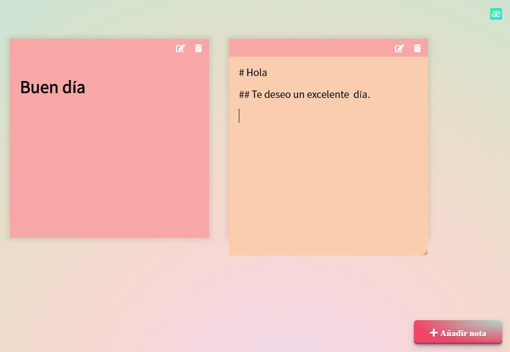

# App de Notas con facilidad para dar estilos con Markdown
`JavaScript  & CSS`

## Vista

[ir a la página](https://tender-hugle-f28617.netlify.app/)

`Se usa libreria de Markdown llamada "Marked" para darle estilos al texto`

