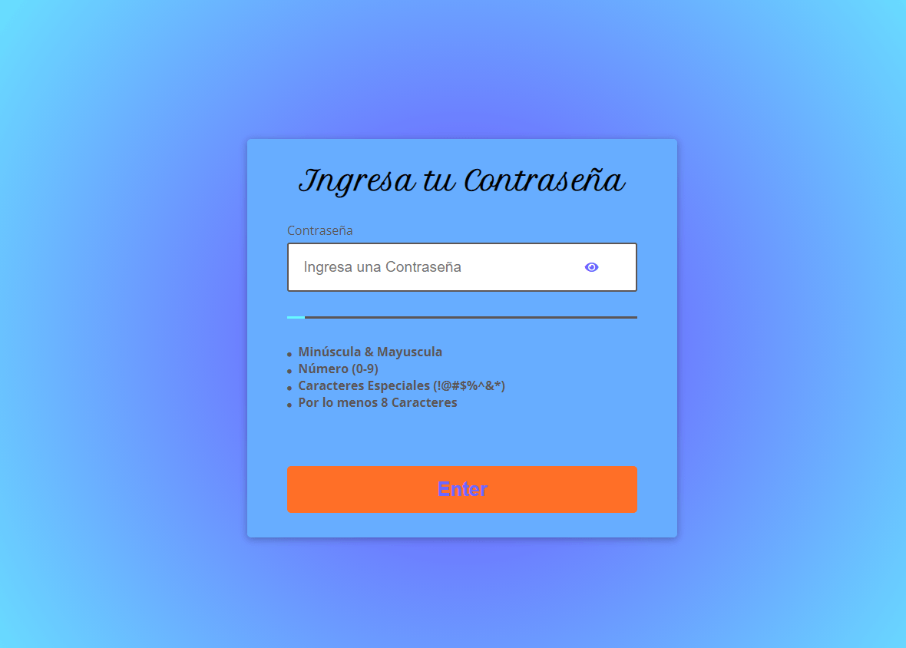

# Validación de contraseña estricta.
`JavaScript & CSS`

### *Notas* :point_down:

- **Validar las minusculas y mayusculas.**
~~~
.match(/([a-z].*[A-Z])|([A-Z].*[a-z])/))
~~~

- **Validar los numeros del 0 al 9.**
~~~
.match(/([0-9])/)
~~~

- **Validar los caracteres especiales.**
~~~
.match(/([!,%,&,@,#,$,^,*,?,_,~])/)
~~~

## Vista de la Página

[Ir a la Página](https://friendly-swartz-d04394.netlify.app/?)