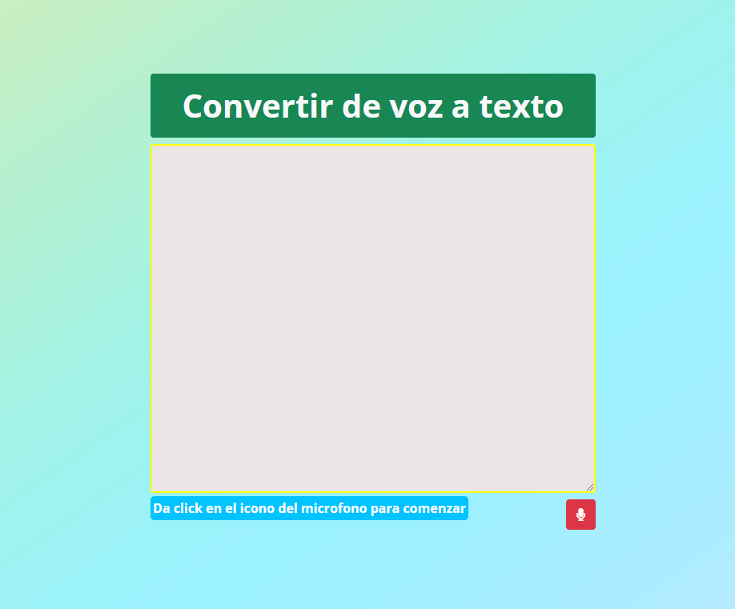
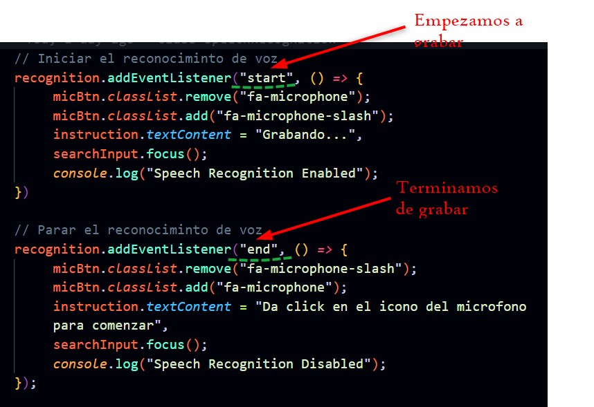
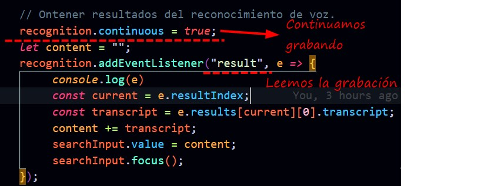

# Convertidor de voz a texto
`JavaScript && Bootstrap`    
    
## Vista de la Página

:computer: [Ir a la Página](https://jovial-nobel-86aba6.netlify.app/) :computer:

#### ``Codigo para verificar si el navergador es compatible con  speechRecognition``

    const speechRecognition = window.speechRecognition || window.webkitSpeechRecognition

#### ``Como utilizar SpeechRecognition``

    const recognition = new speechRecognition();  <== Utilizamos los metódos

**Realizamos las peticiones correspondientes** ⏬ :arrow_down:

 

 1