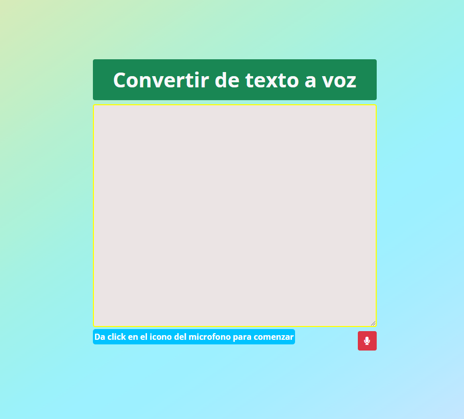

# Convertidor de voz a texto
`JavaScript && Bootstrap`    
    
## Vista de la Página

:computer: [Ir a la Página](https://jovial-nobel-86aba6.netlify.app/) :computer:

#### ``Codigo para verificar si el navergador es compatible con  speechSynthesis``

    const speechSynthesis = window.speechSynthesis;